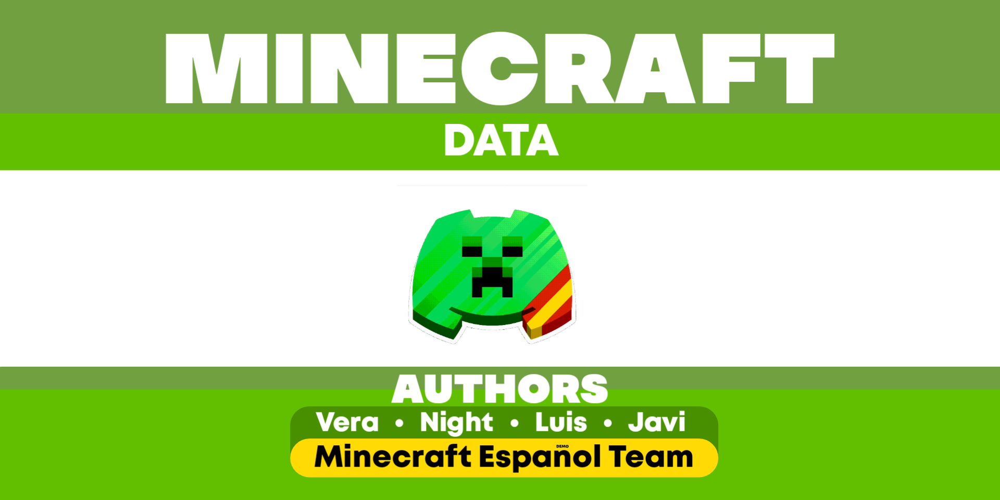

# MINECRAFT DATA
An NPM module that includes a library on all possible aspects of Minecraft, for public use and constantly updated. Some of the options are: mobs, enchantments, effects, structures, biomes...



# THANKS TO...
List of the people who helped making this module:
- Wesly
- Luis
- Javi
- Apple
- Night
- The Discord server team "Minecraft Español" ([Link to the server](https://discord.gg/mc-es))

Thanks to all of them, for making this possible!

# STARTING
1- First of all, you need to install the package, like this:
```
npm i @veraa/minecraft-data
```
2- Import in your code the object constructor:
```js
const MinecraftData = require("@veraa/minecraft-data");
```
3- The use of the constructor is this one:
```js
const variable = new MinecraftData("language").function(anotherVariable);
```
- **"language"** goes for the language you want to use: available ones are __en__ (english), __es__ (spanish) and __fr__ (french)
- **.function()** is the function you are looking for (for different functions, look at the docs, links below)
- **anotherVariable** goes (if needed) for another variable (for example, if you need to look up after a mob through a name)

# DOCUMENTATION:
- **Español**: [Click Aquí](https://github.com/Vera0011/Minecraft_data/blob/master/docs/apiEs.md)
- **English**: [Click Here](https://github.com/Vera0011/Minecraft_data/blob/master/docs/apiEn.md)
- **Français**: [Clickez Ici](https://github.com/Vera0011/Minecraft_data/blob/master/docs/apiFr.md)

# CONTACT:
You need help? Join our [Discord server](https://discord.gg/rzu925jcCb)\
You want to help us? Contact us through `contact.vera0011@gmail.com`
